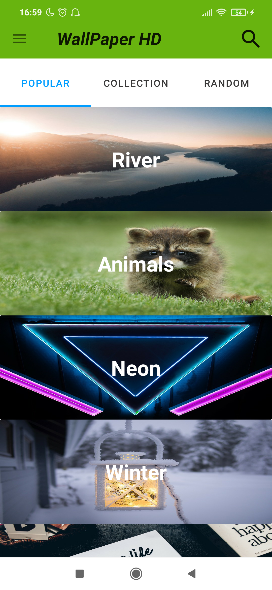
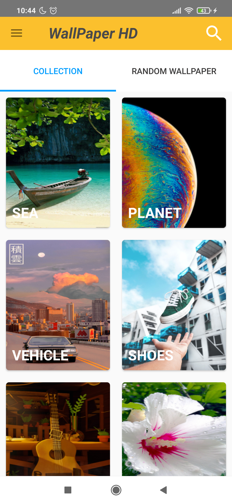
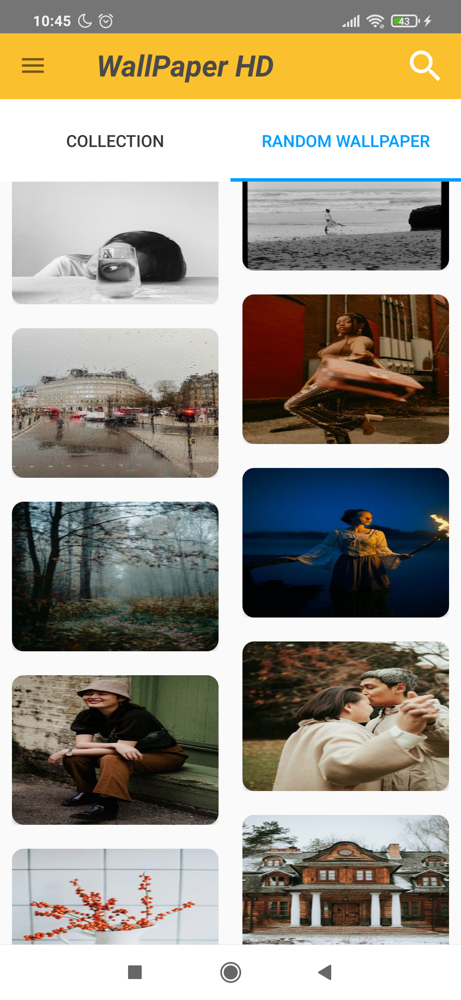
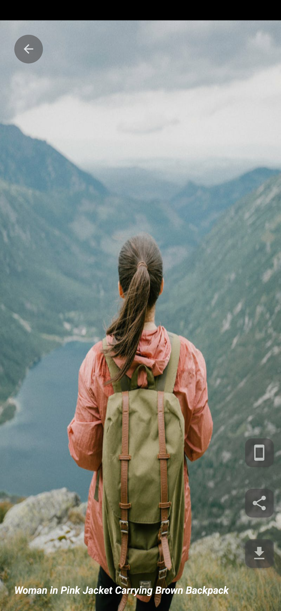

# WallpaperHD
project Advance

# Usage

# Built With
 - MVVM
 - Retrofit2
 - Gson
 - Picasso
 - Api(Pexel), firebase realtime
 - Coroutine kotlin
 - Kotlin extension
 - ViewModel and LiveData
 
# Acknowledgments
  - Inspiration Wallpaper
  - MaterialDesignDemo by NQuangAndroidDEV
